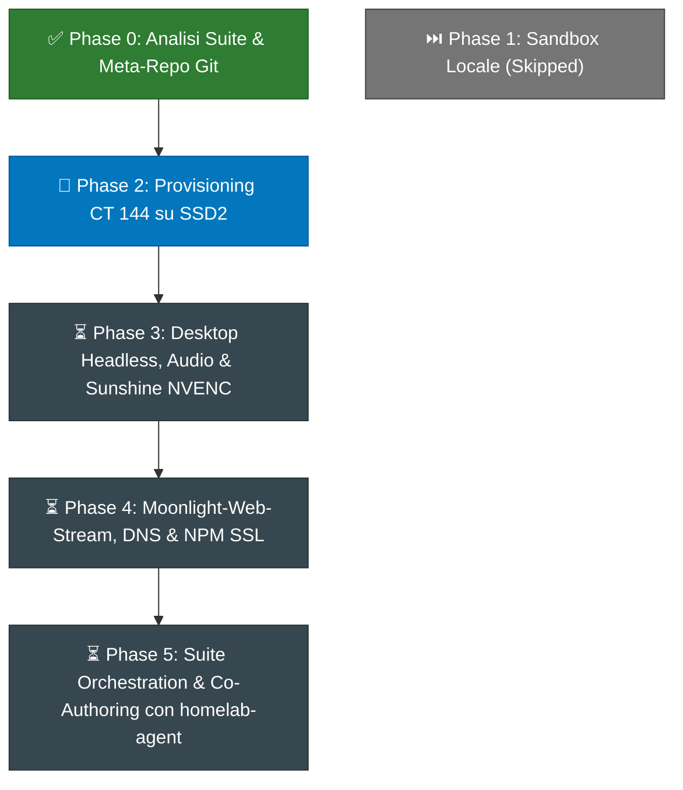

# Creative Suite Workstation — Execution Roadmap & Tracking Board

> **Document Status:** Active Execution Plan & Tracking Board  
> **Target Environment:** Proxmox VE (`DESKTOP-PGMTM0B` - `192.168.1.69`) / CT 144 (`192.168.1.189`)  
> **Source Specs:** [`OPERATIONAL_PLAN.md`](OPERATIONAL_PLAN.md) · [`STREAMING_ARCHITECTURE.md`](../STREAMING_ARCHITECTURE.md)  
> **Current Baseline:** v0.3.0 (CT 144 provisionato su SSD2 con GPU Passthrough V100 e storage condiviso /workspace)  

---

## 📊 Tabella di Avanzamento Generale

```
┌────────────────────────────────────────────────────────┬──────────┬──────────┬─────────────┬──────────────┐
│ Milestone / Componente                                 │ Priorità │ Difficoltà│ Riferimenti │ Stato        │
├────────────────────────────────────────────────────────┼──────────┼──────────┼─────────────┼──────────────┤
│ Phase 0: Architettura, Analisi Suite & Meta-Repo       │ P0       │ Bassa    │ Docs Suite  │ ✅ COMPLETATO│
│ Phase 1: Sandbox di Validazione Locale                 │ P3       │ Bassa    │ Local Dev   │ ⏭️ SKIPPED   │
│ Phase 2: Provisioning Container LXC CT 144 (Proxmox)  │ P0       │ Media    │ Template 133│ ✅ COMPLETATO│
│ Phase 3: Virtual Desktop, PipeWire & Sunshine NVENC    │ P0       │ Alta     │ NVENC / V100│ 🚀 IN CORSO  │
│ Phase 4: WebRTC Gateway (Moonlight-Web), DNS & NPM     │ P1       │ Media    │ WebCodecs   │ ⏳ READY     │
│ Phase 5: Registrazione MetaMCP & Live Co-Authoring     │ P1       │ Alta     │ CT 107/125  │ ⏳ PIANIFICATO│
└────────────────────────────────────────────────────────┴──────────┴──────────┴─────────────┴──────────────┘
```

---

## 🗺️ Grafo delle Dipendenze



---

## 📌 Dettaglio Milestone e Checklist di Lavoro

### Phase 0: Architettura, Ricerca e Meta-Repository (COMPLETATO ✅)
- [x] Analisi delle 13 applicazioni della Creative Suite e mappatura delle equivalenti commerciali.
- [x] Studio dei target compilativi (Desktop nativo, Headless CLI con stdio MCP, WebAssembly con Trunk).
- [x] Analisi tecnica del flusso streaming a bassa latenza: Sunshine NVENC + Moonlight-Web-Stream (WebCodecs/WebRTC).
- [x] Clonazione del repository [`moonlight-web-stream`](../moonlight-web-stream) all'interno del workspace.
- [x] Redazione della documentazione architetturale completa: [`STREAMING_ARCHITECTURE.md`](../STREAMING_ARCHITECTURE.md).
- [x] Ispezione della documentazione di sistema Proxmox in `/root/docs` e correzione delle discrepanze VMID/IP locali.
- [x] Inizializzazione del meta-repository Git con 14 submodules e pubblicazione su GitHub (`DevGiov/homelab-creative-suite`).

---

### Phase 1: Sandbox di Validazione Locale (SKIPPED ⏭️)
*Nota:* Saltata su richiesta dell'utente per procedere direttamente con il deployment server-side su Proxmox VE.
- [-] *Compilazione binari pilota in locale (deckcraft, wordcraft, photocraft).*
- [-] *Test protocollo MCP stdio con Antigravity locale.*

---

### Phase 2: Provisioning Container LXC CT 144 su Proxmox VE (COMPLETATO ✅)
* **Obiettivo:** Creare il container Proxmox dedicato con accelerazione GPU NVIDIA Tesla V100 e storage rapido su `SSD2`.
* **Deliverable e Checklist:**
  - [x] **Clonazione Container**: Clonato il template **`133` (`GpuAgy`)** nel nuovo **VMID `144`** (`hostname: creative-workstation`, volume `vm-144-disk-0` su `SSD2`).
  - [x] **Configurazione Risorse**: Impostati 6 Core CPU, 8 GB RAM, 2 GB Swap, esteso rootfs a 32 GB.
  - [x] **Configurazione Rete**: Assegnato IP statico `192.168.1.189/24` (il .187 era occupato da un device fisico LAN), Gateway `192.168.1.1`, DNS `192.168.1.170` (Pi-hole), searchdomain `deggio.local`.
  - [x] **Mount Volume Workspace**: Configurato bind-mount `/workspace` mappato direttamente sul dataset NAS `/Nass/Nasss/Homelab/creative_suite` (con permessi RW verificati).
  - [x] **Permessi Input Virtuale**: Configurato passthrough `/dev/uinput` (major 10, minor 223) e regola udev mode 0666 per Sunshine.
  - [x] **Verifica GPU Passthrough**: Container avviato con successo (`pct start 144`), eseguito `nvidia-smi` verificando il corretto rilevamento della Tesla V100 16GB (Driver 550.144.03, CUDA 12.4).

---

### Phase 3: Desktop Environment Virtuale, Audio & Sunshine NVENC (IN CORSO 🚀)
* **Obiettivo:** Predisporre l'ambiente grafico headless e il server di streaming Sunshine a 60 FPS.
* **Deliverable e Checklist:**
  - [ ] **Installazione Pacchetti Grafici**: Installare Xorg, driver dummy (`xserver-xorg-video-dummy`), Openbox/XFCE e utility X11.
  - [ ] **Configurazione Display Headless**: Creare `/etc/X11/xorg.conf` con risoluzioni 1080p@60Hz e 1440p@60Hz.
  - [ ] **Server Audio PipeWire**: Configurare PipeWire con virtual loopback sink per cattura audio a bassa latenza.
  - [ ] **Installazione Sunshine**: Scaricare e installare il pacchetto ufficiale Debian/Ubuntu di Sunshine.
  - [ ] **Configurazione Sunshine (`sunshine.conf`)**:
    - Abilitare encoder hardware `nvenc` con preset ultra-low-latency.
    - Configurare permessi `/dev/uinput` per mouse e tastiera virtuali.
    - Abilitare il servizio systemd per avvio automatico al boot.
  - [ ] **Test Funzionalità Sunshine**: Verificare l'avvio della Web UI di Sunshine su `https://192.168.1.189:47990`.

---

### Phase 4: Moonlight-Web-Stream, DNS & Nginx Proxy Manager (PRONTO ⏳)
* **Obiettivo:** Consentire l'accesso alla workstation da qualsiasi browser web tramite HTTPS e WebRTC.
* **Deliverable e Checklist:**
  - [ ] **Deploy Docker Moonlight-Web-Stream**:
    - Configurare `docker-compose.yaml` in `/opt/moonlight-web` su CT 144 (porte 8080 HTTP, 40000-40100/udp WebRTC).
    - Avviare il container e verificare la pagina di login web.
  - [ ] **Accoppiamento (Pairing) Sunshine ➔ Web Client**:
    - Generare il PIN di accoppiamento ed eseguire il pairing con Sunshine.
  - [ ] **Configurazione DNS Pi-hole (CT 114)**:
    - Aggiungere il record locale `creative.deggio.local` ➔ `192.168.1.143` (NpmLocal).
  - [ ] **Configurazione Reverse Proxy (CT 121 - NpmLocal)**:
    - Creare il Proxy Host per `creative.deggio.local` verso `http://192.168.1.189:8080`.
    - Abilitare **Websockets Support** e certificato SSL (Force SSL attivo per sbloccare WebCodecs).
  - [ ] **Test E2E Browser Streaming**: Verificare lo streaming video fluido, l'audio e la risposta ai controlli da un browser esterno.

---

### Phase 5: Registrazione MetaMCP (CT 107) & Live Co-Authoring con `homelab-agent` (PIANIFICATO ⏳)
* **Obiettivo:** Esporre gli strumenti di controllo della Suite Creativa tramite **MetaMCP** (`CT 107`) come hub centralizzato per renderli universalmente disponibili (Antigravity, Claude, script esterni e `homelab-agent`), integrando poi in `homelab-agent` le ottimizzazioni specifiche (rollback dichiarativo, visual grounding e sincronizzazione streaming).
* **Deliverable e Checklist:**
  - [ ] **Installazione Binari & Demoni di Controllo (CT 144)**:
    - Compilare/copiare i binari della suite in `/opt/creative-suite/bin`.
    - Creare `/opt/creative-suite/scripts/start-session.sh` con canali IPC attivi (`deckcraft --control 7979`, `wordcraft --control 7981`, `photocraft --control 7878`, ecc.).
  - [ ] **Creative Suite MCP Bridge Server (CT 144)**:
    - Configurare il server/bridge MCP unificato (es. SSE o Streamable HTTP su porta `7900`) che mappa i comandi di controllo delle app.
  - [ ] **Registrazione Upstream su MetaMCP (CT 107)**:
    - Registrare l'endpoint `http://192.168.1.189:7900/sse` in MetaMCP come upstream `creative-suite`.
    - Verificare la discovery immediata dei tool su Antigravity IDE e client MCP esterni con prefisso `creative-suite__*`.
  - [ ] **Discovery Dinamica & Ottimizzazioni Specifiche in `homelab-agent` (CT 125)**:
    - Verificare l'auto-discovery dinamica dei tool tramite `MetaMCPClient` (zero-code injection).
    - Definire in `tool_catalog.py` gli schemi dichiarativi di **Rollback Transazionale (Saga LIFO)** per le operazioni creative (es. undo shape/slide/layer).
    - Aggiornare `backend/mode_policy.py` per autorizzare i tool creative nei profili appropriati.
    - Implementare il **Visual Grounding** per catturare snapshot dal frame buffer/Sunshine per il feedback visivo all'utente.
  - [ ] **Test E2E Co-Authoring Live**:
    - Aprire la sessione di streaming nel browser su `https://creative.deggio.local`.
    - Inviare un comando a `homelab-agent` (o ad Antigravity) per manipolare una slide o un'immagine.
    - Verificare l'aggiornamento grafico immediato a video a 60 FPS in tempo reale.
