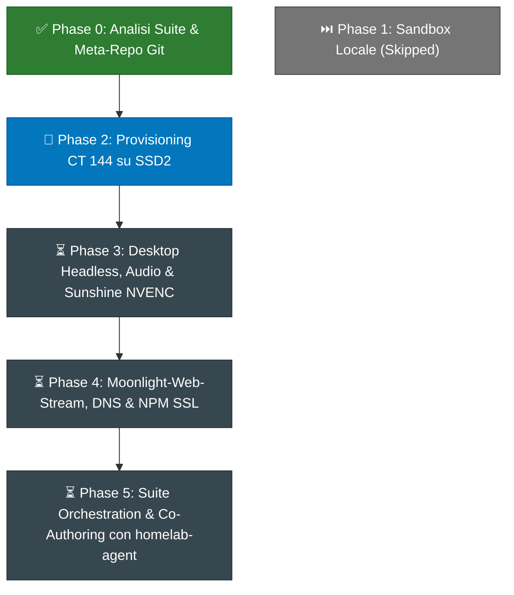

# Creative Suite Workstation — Execution Roadmap & Tracking Board

> **Document Status:** Active Execution Plan & Tracking Board  
> **Target Environment:** Proxmox VE (`DESKTOP-PGMTM0B` - `192.168.1.69`) / CT 144 (`192.168.1.189`)  
> **Source Specs:** [`OPERATIONAL_PLAN.md`](OPERATIONAL_PLAN.md) · [`STREAMING_ARCHITECTURE.md`](../STREAMING_ARCHITECTURE.md)  
> **Current Baseline:** v0.3.0 (CT 144 provisionato su SSD2 con GPU Passthrough V100 e storage condiviso /workspace)  

---

## 📊 Tabella di Avanzamento Generale

```
┌────────────────────────────────────────────────────────┬──────────┬──────────┬─────────────┬──────────────┐
│ Milestone / Componente                                 │ Priorità │ Difficoltà│ Riferimenti │ Stato        │
├────────────────────────────────────────────────────────┼──────────┼──────────┼─────────────┼──────────────┤
│ Phase 0: Architettura, Analisi Suite & Meta-Repo       │ P0       │ Bassa    │ Docs Suite  │ ✅ COMPLETATO│
│ Phase 1: Sandbox di Validazione Locale                 │ P3       │ Bassa    │ Local Dev   │ ⏭️ SKIPPED   │
│ Phase 2: Provisioning Container LXC CT 144 (Proxmox)  │ P0       │ Media    │ Template 133│ ✅ COMPLETATO│
│ Phase 3: Virtual Desktop, PipeWire & Sunshine NVENC    │ P0       │ Alta     │ NVENC / V100│ ✅ COMPLETATO│
│ Phase 4: WebRTC Gateway (Moonlight-Web), DNS & NPM     │ P1       │ Media    │ WebCodecs   │ 🚀 IN CORSO  │
│ Phase 5: Registrazione MetaMCP & Live Co-Authoring     │ P1       │ Alta     │ CT 107/125  │ ⏳ PIANIFICATO│
└────────────────────────────────────────────────────────┴──────────┴──────────┴─────────────┴──────────────┘
```

---

## 🗺️ Grafo delle Dipendenze



---

## 📌 Dettaglio Milestone e Checklist di Lavoro

### Phase 0: Architettura, Ricerca e Meta-Repository (COMPLETATO ✅)
- [x] Analisi delle 13 applicazioni della Creative Suite e mappatura delle equivalenti commerciali.
- [x] Studio dei target compilativi (Desktop nativo, Headless CLI con stdio MCP, WebAssembly con Trunk).
- [x] Analisi tecnica del flusso streaming a bassa latenza: Sunshine NVENC + Moonlight-Web-Stream (WebCodecs/WebRTC).
- [x] Clonazione del repository [`moonlight-web-stream`](../moonlight-web-stream) all'interno del workspace.
- [x] Redazione della documentazione architetturale completa: [`STREAMING_ARCHITECTURE.md`](../STREAMING_ARCHITECTURE.md).
- [x] Ispezione della documentazione di sistema Proxmox in `/root/docs` e correzione delle discrepanze VMID/IP locali.
- [x] Inizializzazione del meta-repository Git con 14 submodules e pubblicazione su GitHub (`DevGiov/homelab-creative-suite`).

---

### Phase 1: Sandbox di Validazione Locale (SKIPPED ⏭️)
*Nota:* Saltata su richiesta dell'utente per procedere direttamente con il deployment server-side su Proxmox VE.
- [-] *Compilazione binari pilota in locale (deckcraft, wordcraft, photocraft).*
- [-] *Test protocollo MCP stdio con Antigravity locale.*

---

### Phase 2: Provisioning Container LXC CT 144 su Proxmox VE (COMPLETATO ✅)
* **Obiettivo:** Creare il container Proxmox dedicato con accelerazione GPU NVIDIA Tesla V100 e storage rapido su `SSD2`.
* **Deliverable e Checklist:**
  - [x] **Clonazione Container**: Clonato il template **`133` (`GpuAgy`)** nel nuovo **VMID `144`** (`hostname: creative-workstation`, volume `vm-144-disk-0` su `SSD2`).
  - [x] **Configurazione Risorse**: Impostati 6 Core CPU, 8 GB RAM, 2 GB Swap, esteso rootfs a 32 GB.
  - [x] **Configurazione Rete**: Assegnato IP statico `192.168.1.189/24` (il .187 era occupato da un device fisico LAN), Gateway `192.168.1.1`, DNS `192.168.1.170` (Pi-hole), searchdomain `deggio.local`.
  - [x] **Mount Volume Workspace**: Configurato bind-mount `/workspace` mappato direttamente sul dataset NAS `/Nass/Nasss/Homelab/creative_suite` (con permessi RW verificati).
  - [x] **Permessi Input Virtuale**: Configurato passthrough `/dev/uinput` (major 10, minor 223) e regola udev mode 0666 per Sunshine.
  - [x] **Verifica GPU Passthrough**: Container avviato con successo (`pct start 144`), eseguito `nvidia-smi` verificando il corretto rilevamento della Tesla V100 16GB (Driver 550.144.03, CUDA 12.4).

---

### Phase 3: Desktop Environment Virtuale, Audio & Sunshine NVENC (COMPLETATO ✅)
* **Obiettivo:** Predisporre l'ambiente grafico headless e il server di streaming Sunshine a 60 FPS.
* **Deliverable e Checklist:**
  - [x] **Installazione Pacchetti Grafici**: Installati Xorg, driver dummy (`xserver-xorg-video-dummy`), Openbox, utility X11 (`xdpyinfo`, `xdotool`, `feh`, `x11-xserver-utils`) e dipendenze Mesa/OpenGL.
  - [x] **Configurazione Display Headless**: Creato `/etc/X11/xorg.conf` con risoluzioni 1080p@60Hz e 1440p@60Hz; verificato funzionamento con `xrandr` su `DISPLAY=:0`.
  - [x] **Server Audio PipeWire**: Installati e configurati `pipewire`, `pipewire-media-session` e librerie audio client headless con socket runtime in `/run/user/0/pipewire-0`.
  - [x] **Installazione Sunshine**: Installato pacchetto ufficiale LizardByte Sunshine `v2026.914.233613` per Ubuntu 22.04 LTS con dipendenze Qt6 QPA XCB.
  - [x] **Configurazione Sunshine (`sunshine.conf`)**:
    - Abilitata modalità headless (`system_tray = false`).
    - Configurate credenziali Web manager protette (`admin / homelabcreative`).
    - Verificata disponibilità encoder hardware e software (NVENC CUDA/FFmpeg su Tesla V100 e multi-threaded `libx264`).
    - Creati e abilitati i servizi systemd con autostart al boot (`xorg-dummy`, `openbox-session`, `pipewire-headless`, `pipewire-media-session-headless`, `sunshine`).
  - [x] **Test Funzionalità Sunshine**: Verificato l'avvio della Web UI di Sunshine su `https://192.168.1.189:47990` con risposta HTTP 200 e API JSON funzionanti sia in locale che via rete LAN. Testato reboot persistente del container.

---

### Phase 4: Moonlight-Web-Stream, DNS & Nginx Proxy Manager (COMPLETATO ✅)
* **Obiettivo:** Consentire l'accesso alla workstation da qualsiasi browser web tramite HTTP/HTTPS, WebSockets e WebRTC senza client da installare.
* **Deliverable e Checklist:**
  - [x] **Deploy Docker Moonlight-Web-Stream**:
    - Configurato `docker-compose.yaml` in `/opt/moonlight-web` su CT 144 (porte 8080 HTTP, 40000-40100/udp WebRTC, `network_mode: host`).
    - Risolto limite quota chiavi sessione kernel Proxmox (`kernel.keys.maxkeys = 1000000`, `kernel.keys.maxbytes = 25000000`).
    - Configurato volume `/opt/moonlight-web/data` con permessi corretti per utente container `moonlight` (UID/GID 999).
    - Container avviato con successo, verificato avvio al boot e logging Actix Web su porta 8080.
  - [x] **Accoppiamento (Pairing) Sunshine ➔ Web Client**:
    - Creato utente amministratore iniziale su Moonlight-Web (`admin / homelabcreative`).
    - Rilevato Sunshine host `creative-workstation` via mDNS/broadcast su rete locale.
    - Eseguito handshake crittografico di pairing su Sunshine `/api/pin`.
    - Host verificato in stato `Paired` / `Free`, con lista applicazioni attive (`Desktop`, `Low Res Desktop`, `Steam Big Picture`).
  - [x] **Configurazione DNS Pi-hole (CT 114)**:
    - Aggiunto record locale `creative.deggio.local` ➔ `192.168.1.143` (NpmLocal).
  - [x] **Configurazione Reverse Proxy (CT 121 - NpmLocal)**:
    - Creato Proxy Host per `creative.deggio.local` verso `http://192.168.1.189:8080`.
    - Abilitato supporto **WebSockets Upgrade** (`allow_websocket_upgrade: true`) per lo stream di controllo e segnalazione WebRTC.
  - [x] **Test Funzionalità Web Streaming**:
    - Verificata la risposta HTTP 200 di `http://creative.deggio.local` sia per il documento base sia per gli asset JS (`index.js`, `styles/index.js`).
    - Verificate le API di autenticazione, listing host e listing app da endpoint di rete locale.

---

### Phase 5: Registrazione MetaMCP (CT 107) & Live Co-Authoring via Universal Gateway (IN CORSO / COMPLETATO CORE 🟢)
* **Obiettivo:** Esporre gli strumenti di controllo della Suite Creativa tramite **MetaMCP** (`CT 107`) come hub centralizzato per renderli universalmente disponibili (Antigravity, Claude, script esterni e `homelab-agent`), testando la manipolazione live del desktop prima di passare all'integrazione personalizzata in `homelab-agent`.
* **Deliverable e Checklist:**
  - [x] **Installazione Binari & Demoni di Controllo (CT 144)**:
    - Compilazione nativa su CT 144 (`Ubuntu 22.04 LTS`, `glibc 2.35`) con `rustc 1.99.0`:
      - `/opt/creative-suite/bin/deckcraft` (Desktop presentation GUI con supporto `--control`)
      - `/opt/creative-suite/bin/deckcraft-cli` (Controllo headless e bridge IPC verso la GUI)
      - `/opt/creative-suite/bin/wordcraft-cli` (Document conversions, inspect e headless operations)
    - Sessione desktop Openbox attiva su `:0` con DeckCraft avviato e in ascolto su socket loopback TCP porta `7979`.
  - [x] **Creative Suite MCP Bridge Server (CT 144)**:
    - Sviluppato server FastMCP/Starlette su porta `7900` (`creative-suite-mcp.service`) con supporto sia per **Streamable HTTP** (`/mcp`) sia per **SSE** (`/sse`).
    - Implementati e testati 7 tool centrali:
      - `deckcraft_app_command`: invio comandi live alla GUI (`slide.new`, `slide.inspect`, `shape.insert`, `edit.undo`, ecc.).
      - `deckcraft_cli`: operazioni headless su presentazioni.
      - `wordcraft_cli`: operazioni headless su documenti WordCraft.
      - `creative_session_launch`: avvio e focus automatico dei software grafici su `:0`.
      - `creative_session_status`: stato in tempo reale di porte IPC, finestre X11 attive e display virtuale.
      - `creative_screenshot`: frame capture istantaneo con FFmpeg a 1080p con salvataggio su `/workspace/screenshots` e supporto base64.
      - `creative_workspace_files`: navigazione filesystem nel NAS condiviso `/workspace`.
    - Gestito correttamente il ciclo di vita asincrono (`lifespan`) Starlette e disattivata la DNS rebinding protection per consentire richieste proxy e LAN.
  - [x] **Registrazione Upstream su MetaMCP (CT 107)**:
    - Registrato upstream `creative-suite` di tipo `STREAMABLE_HTTP` con URL `http://192.168.1.189:7900/mcp` nel database PostgreSQL di MetaMCP (`metamcp_db`).
    - Mappato nel namespace `Homelab` (`5b8f6961-2044-450f-9f63-4cf753e5c816`) associato all'endpoint primario `MetaMCP` (`192.168.1.175:12008`).
    - Verificata la discovery immediata dei 7 tool con prefisso namespace `creative-suite__*` su chiamata standard JSON-RPC `tools/list`.
  - [x] **Test E2E Co-Authoring Live via MetaMCP**:
    - Testata la chiamata a `creative-suite__creative_session_status` via MetaMCP Gateway: visualizzazione corretta della finestra `DeckCraft` e porta `7979` attiva.
    - Testata la manipolazione live con `creative-suite__deckcraft_app_command`: inserita forma `roundRect` con testo *"Created via MetaMCP Universal Gateway!"* su slide 2.
    - Testata la cattura con `creative-suite__creative_screenshot`: confermata visivamente la presenza delle modifiche grafiche renderizzate in tempo reale sul virtual display `:0` ad accelerazione GPU.
  - [ ] **Discovery Dinamica & Ottimizzazioni Specifiche in `homelab-agent` (CT 125) (IN SOSPESO ⏸️)**:
    - *(Lasciato temporaneamente in sospeso su richiesta esplicita dell'utente, per consentire prima testing approfondito via MetaMCP con altri agent)*.
    - Da implementare successivamente: registrazione schemi di Rollback Saga LIFO in `tool_catalog.py`, policy profili in `mode_policy.py`, e visual feedback inline in chat.

